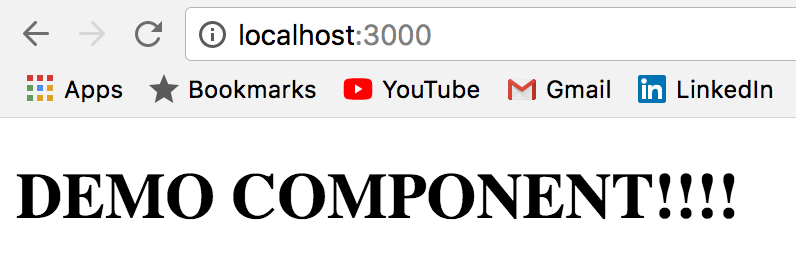

# Publishing React Components in NPM (Intro to Webpack)

### Goal
- Write, Test, and Publish your own React Component.
- Learn how to use webpack to build an ES6 / JSX friendly dev environment.
- Learn basic documentation best practices.

### Summary

We will be creating a single React component that will be directly importable into any ReactJS / NodeJS project using NPM.

We will use webpack to transpile JSX and ES6 into ES5 so that it is browser-compatible. 

In order to test our React component as we develop, we will make a separate React environment using `create-react-app`.

Successful open source projects require clear, concise, and informative documentation. We will go over the basics of writing good documentation so other developers know how to implement your project successfully.

### Setup

`git clone <url-added-later>`

Your project directory should have the following folders / files:
```
/project-folder
    /src
        index.js
    .babelrc
    .gitignore
    .nvmrc
    package.json
    README.md
    webpack.config.js
```

You will want to alter the fields in `package.json` to reflect what your project is actually about (repository, description, author, etc.).

### Webpack

**What is it?**

Webpack is a module bundler. It simply takes as input a set of code modules, combines them, and outputs a new file.

We are using webpack for two reasons:
1) React Components are very modular.
2) Webpack, combined with a transpiler like Babel, allows us to write ES6 and JSX without worrying about browser incompatibility.

**Installing Dependencies and Configuring Webpack**

- `npm install`

Add this configuration object in `.babelrc`, which defines which presets and plugins to use when babel is transpiling:
```json
{
  "presets": ["env"],
  "plugins": [
    "transform-object-rest-spread",
    "transform-react-jsx"
  ]
}
```

The configuration object in `webpack.config.js` defines the rules for how to bundle / transpile our ES6 code: 
```javascript
//webpack.config.js

let path = require('path');
module.exports = {
    //defines the path to the input module:
  entry: './src/index.js', 
    //defines the filename and path for the output:
  output: {
    path: path.resolve(__dirname, 'build'),
    filename: 'index.js',
    libraryTarget: 'commonjs2' 
  },
    //defines the rules for how to transpile .js and .css files:
  module: {
    rules: [
      {
        test: /\.js$/,
        include: path.resolve(__dirname, 'src'),
        exclude: /(node_modules|bower_components|build)/,
        use: {
          loader: 'babel-loader',
          options: {
            presets: ['env']
          }
        }
      },
      {
        test: /\.css$/,
        use: [ 'style-loader', 'css-loader' ]
      }
    ]
  },
  externals: {
    'react': 'commonjs react' 
  }
};

```
In order to implement webpack we need to add a couple scripts in `package.json`:
```json
"scripts":{
    "test": "echo \"Error: no test specified\" && exit 1",
    "start": "webpack --watch",
    "build": "webpack"
}
```
Now, when we run `npm start` webpack will automatically bundle our code every time it detects a change while we edit. `npm run build` will simply bundle it on command.

Once all your files are all set up, simply run:
- `npm run start`
- `npm link` (this allows you to import your component into the test environment)

### Building the Component
The `/src` folder is where you will write all your code. Let's make a simple React Component:
```javascript
// demo-component/src/index.js
import React, { Component } from 'react'

export default class DemoComponent extends Component {
    render() {
        return (
            <div>
                <h1>DEMO COMPONENT!!!</h1>
            </div>
        )
    }
}
```
That was easy.

### Testing the Component
Components can be major projects on their own. It would be a pain to attempt to write all our code at once, publish it, and then import it into a new project only to find out we have an error. 

I'm going to assume the reader has a basic knowledge of how to set up a React environment using `create-react-app`. In a separate project folder called `test-env` create a new React app and make a component called `Tester.js`. Render it from `src/index.js` and run `npm start` to get the environment going. Don't forget to import the Demo component!

```javascript
// /test-env/src/Tester.js

import React from 'react';
import DemoComponent from "demo-component";

export default function Tester(props){
    return(
        <div>
            <DemoComponent />
        </div>
    )
}
```
You should see a message displayed on the screen in your browser!


As you make changes to `DemoComponent`, you should see them update immediately in your browser as long as your test environment is running.

### Documentation

### Publish!

Once you are happy with how your component works and your documentation is complete, you're ready to publish!

It's insanely simple. From your project folder run:
- `npm run build`
- `npm publish`

Anytime you need to make an edit to your package make sure to adjust the `version` property in `package.json`.

Congrats!


